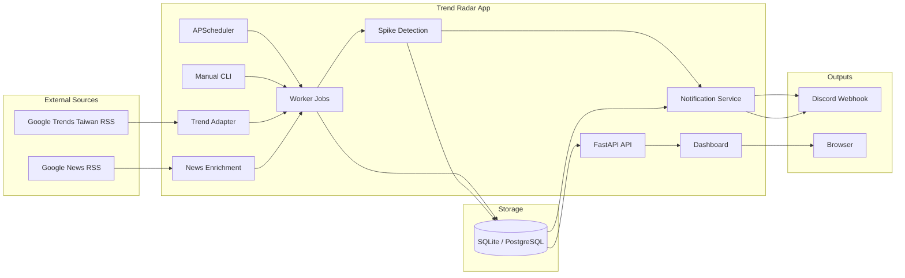

# Trend Radar

Trend Radar 是一個個人用的熱門趨勢監測系統。它會定時抓取台灣熱門關鍵字，保存歷史資料，偵測爆量趨勢，透過 Discord 主動推播，並提供 Dashboard 查詢近期與歷史趨勢。

## 為什麼做這個

平常追熱門話題時，資訊來源通常分散在搜尋趨勢、新聞網站與社群討論裡，很難快速判斷哪些話題只是短暫出現，哪些正在持續升溫。Trend Radar 的目標是把「蒐集、保存、偵測、通知、查詢」集中成一個小型資料產品。

這個專案同時用來展示台灣 IT 職缺常見的實務能力：Python、SQL、ETL、API 串接、排程、自動化通知、Dashboard 與 Docker 部署。

## 主要功能

- 定時抓取 Google Trends Taiwan 熱門關鍵字
- 將每次抓取結果以 snapshot 方式保存到資料庫
- 使用規則判斷爆量關鍵字
- 發送 Discord 每日摘要與爆量警報
- Dashboard 顯示最新熱門、最近 24 小時警報、系統狀態與關鍵字歷史曲線
- 使用 Google News RSS 為關鍵字補充少量新聞連結
- 提供手動 CLI，方便 demo 或排錯時立即抓取資料

## 技術棧

- `Python`：主要開發語言
- `FastAPI`：API 與 Dashboard server
- `SQLAlchemy`：資料模型與查詢
- `PostgreSQL`：Docker 模式的主要資料庫
- `SQLite`：本機快速開發預設資料庫
- `APScheduler`：本地排程抓取與每日摘要
- `httpx` / `feedparser`：外部 HTTP 與 RSS 解析
- `Discord Webhook`：通知整合
- `Chart.js`：關鍵字歷史趨勢圖
- `Docker Compose`：本地 PostgreSQL 部署
- `pytest`：自動化測試

## 系統架構



資料流程以排程 worker 為核心：APScheduler 或手動 CLI 觸發同一批 jobs，先抓 Google Trends，寫入 snapshot / keyword / observation，再補新聞連結、執行爆量規則，最後在需要時推播 Discord。Dashboard 透過 FastAPI API 讀取資料庫，只負責查詢與顯示，不承擔抓取流程。

## 安裝方式

### 本機 SQLite 模式

```bash
python -m venv .venv
source .venv/bin/activate
pip install -e ".[dev]"
cp .env.example .env
.venv/bin/python -m app.cli init-db
```

`.env.example` 預設使用 SQLite，適合快速啟動與本機測試。若要啟用 Discord 推播，請在 `.env` 填入 `DISCORD_WEBHOOK_URL`。

### Docker PostgreSQL 模式

```bash
docker compose up --build
```

Docker Compose 會啟動 `web` 與 `db` 兩個 service。`db` 使用 PostgreSQL，並透過 healthcheck 確保 web app 在資料庫 ready 後才啟動。

## 執行方式

啟動本機 Dashboard：

```bash
.venv/bin/uvicorn app.main:app --reload
```

開啟：

```text
http://127.0.0.1:8000
```

手動執行 job：

```bash
.venv/bin/python -m app.cli collect-now
.venv/bin/python -m app.cli send-summary
```

預設排程：

- 每 60 分鐘抓取一次熱門關鍵字
- 每天 `01:52` 發送 Discord daily summary

## 主要 API

- `GET /`
- `GET /health`
- `GET /api/system/status`
- `GET /api/trends/latest`
- `GET /api/trends/series?keyword=ai&days=7`
- `GET /api/alerts/recent`
- `GET /api/keywords/{id}/news`

## Demo

完整 demo 操作請看 [DEMO_FLOW.md](./DEMO_FLOW.md)。  
GCP VM + Docker 部署學習教學請看 [GCP_VM_DOCKER_DEPLOYMENT.md](./GCP_VM_DOCKER_DEPLOYMENT.md)。
專案背景與 MVP 取捨請看 [STORY.md](./STORY.md)。

## 未來規劃

- 補充 job run 狀態頁，讓排錯資訊更完整
- 強化 Dashboard 指標，例如最近 7 天常見關鍵字
- 加入 GitHub Actions CI，讓測試在 push / pull request 時自動執行
- 評估部署到固定主機，避免本機關閉後排程停止
- 在不擴大 MVP 複雜度的前提下改善新聞去重與資料品質

## MVP 限制

- 只支援 Google Trends Taiwan 單一趨勢來源
- 只支援 Discord Webhook 單一通知渠道
- 不做登入、多人使用或權限管理
- 不做 AI 摘要、全文爬蟲或多來源比對
- 目前以本地長時間運行為主，暫不導入免費 serverless 排程
